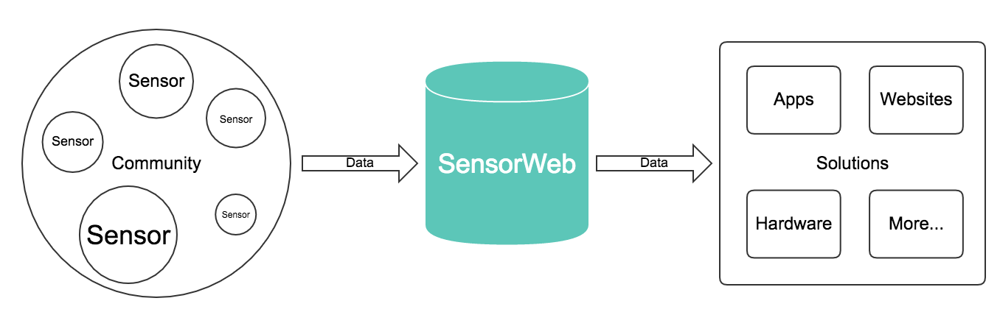

# Lean Plan for SensorWeb
We're focusing on validating end-user value and creating a minimum viable product(MVP) for them at this stage, not creating an open data platform for 3-rd party developers or makers.

SensorWeb is an open data platform for 3-rd party developers or makers in long term. And Project PM2.5 is about creating solutions(apps or hardware) with SensorWeb technology for end-users.

### Q&A
* Why we are not creating the data platform at this stage?
  - We don't have experiences about a successful data project, hence we don't know about key factors to support a successful platform for now. We might know after validated our end-user value.
* Why SensorWeb platform's users are developers or makers, not end-users?
  - Our data service is for helping developers or makers focus on developing their ideas. We provide back-end support. And they will not need to re-build their data back-end.
  - End-users cannot use our data service directly. They cannot write code.
  - End-users cannot build an IoT device for their needs.
  - As end-users, they just want to use products to improve their life.

### How to Feedback
Please [add a new issue][add-issue], and let's discuss your ideas and questions on the [Issues][issues]. Thanks for your feedback.

## SensorWeb's Lean Framework
### Value Hypothesis
* Question to Answer
  - Is there already sufficient demand for consume PM2.5 data
* Customers want to consume PM2.5 data to avoid exposure.

### Growth Hypothesis
* Question to Answer
  - Is the demand strong enough to generate viral effect?
* Customers want to help us spread the word

## SensorWeb's Hypothesis for Schools
### Value Hypothesis
* Teachers in the schools with serious air pollution problem(e.g. Nearby Yunlin, Taiwan) want to have real-time PM2.5 data from nearby to help students live healthier in schools(e.g. PE class should be in the indoor when air quality is bad).
  - Air pollution demonstrations are held in Changhua : http://goo.gl/fcwR7N
  - Number of sensor station in Changhua is not enough : http://goo.gl/QENUpR 
  - The top two worst cities are in the center part of Taiwan: http://goo.gl/SrLNf1

### Growth Hypothesis
* Teachers want to teach other (schools') teachers setup their own PM2.5 stations.

### Why School(with Big Air Pollution Concerns)
* Pros
  - We can do one time deployment to deliver our values to thousands students and teachers.
  - Whole society(government) really care about education environment. So it will help us to create the virus effects.
  - We already have some connections with several schools. (three schools with thousands people deploy our PM2.5 stations) Especilly, a teacher from Nanguo Elementary School(2500+ people) in Changhua, Taiwan is using SensorWeb as the class material in his class. He is also planning a semester science project with his students to improve their air pollution issues.
  - The air quality is really bad in center part of Taiwan because Formosa Plastics Corp's (FPC) sixth naphtha cracker complex is located there. And Nanguo Elementary School is also located in center part of Taiwan.
* Cons
  - It would be difficult for schools to make purchases. (we can just give them our PM2.5 for free)
  - We don't know how people in schools cares about PM2.5. (same situation for most groups)
  - We might not have sufficient knowledge about actions they will take. (same situation for most groups)

## MVP 1 (March 1 2016 ~)
### Assumption
* People in schools want to know their PM2.5 concentration by going to our website.

### Features
* PM Sensor with basic visualization on SensorWeb website.

### User Actions
* Teacher put static link on school website after a few days.
* Teacher embedded widget on school website after 3 weeks.

### Metrics
* Static link click through session count per day: 66/16 = 4.125
* Widget link click through session count per day: 115/29 = 3.96
* Widget click through conversion rate: 1.38%

### Learning
* The School is willing to add link to the Sensor Detail page.
* The School want a widget to display real-time data.
* Click through rate drops after a few days of installation.

### Following Assumptions
* People don't know what options they have when have bad readings. (by interview)
* People don't trust the data. (by interview)
* People think there's friction to get data (guessing from PV drop)
* Website customers aren't necessarily people in school (guessing from PV drop)
* Most people in schools don't know about the sensor (assumption 2 and guessing from PV drop)

### TODOs
* Interview with the school again to confirm our assumptions and options they have when air quality is bad.
* Show them the benchmark of air quality sensors. Our sensor is accuracy enough for them to take actions.

## MVP 2
### Assumption
* (PE class) teachers will take action(e.g. go to indoor for PE classes when air quality is bad) if we provide dedicated app for them.

### Features
* App for (PE class) teachers to display air quality of the class' location.
* App prompt the teacher to tell us what action he took.

### Metrics
* (PE Class) teachers will take action(e.g. go to indoor for PE classes) when air quality is bad.

### Learning
* ...

### TODOs
* ...

## Maintainers
* [Evan Tseng](https://github.com/evanxd)
* [Eddie Lin](https://github.com/yshlin)
* [Steve Chung](https://github.com/steveck-chung)

[add-issue]: https://github.com/sensor-web/sensorweb-plan/issues/new
[issues]: https://github.com/sensor-web/sensorweb-plan/issues
